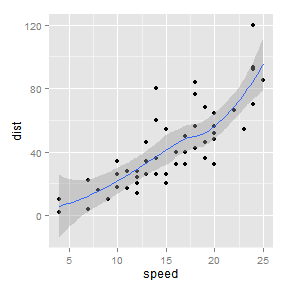

% Example
%[[[[Tyler Rinker](https://github.com/trinker)]]]=small
% 3-13-13


# Slide 1
this is cool    
[[[this it a note]]]=notes

# Slide 2
To run these use:

```r
reveal.js(ref.page = NULL)
```

[[[this it a 2 note]]]=notes

# 
[[[cokNUTGtoM4]]]=yt

# Slide C

```
## Warning: package 'ggplot2' was built under R version 2.15.2
```

 


[[[]]]=sud
# Slide A [[[]]]=bg-soothe

# Slide B
> He was a very important man who was evidently the best situation that he could 
> possible attend to but that's this slide anyway!

# Slide C  
  
- rvgvrrg    
- dvfvgvgfv    
- dfv    
- very
- d [[[]]]=frag-highlight-green    
[[[this it a 3 note]]]=notes  

[[[]]]=eud

# Last slide
For more see: [reveal.js](http://lab.hakim.se/reveal-js/#/)
